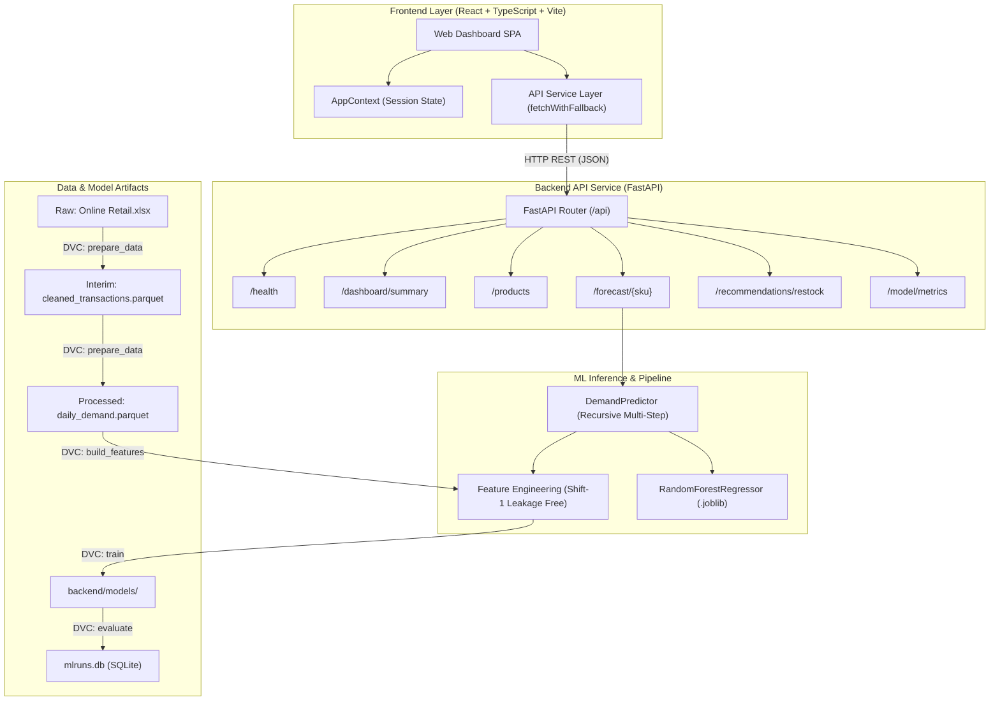

# System Architecture — MORROW

> "A little ahead of demand."

This document details the high-level architecture, subsystem boundaries, and end-to-end data flows for **MORROW**, an AI-driven retail demand forecasting and inventory optimization platform.

---

## 🏗 High-Level Architecture

---

## 🔄 End-to-End Workflows

### 1. Demand Forecast Flow (`GET /api/forecast/{sku}?horizon={days}`)
1. **User Action**: The operator selects a product SKU and forecast horizon (7, 14, or 30 days) on `/forecast`.
2. **Frontend Call**: `getDemandForecast(productId, horizon)` sends an HTTP request to `http://localhost:8000/api/forecast/{productId}?horizon={horizon}`.
3. **Validation**: FastAPI validates product presence and asserts `horizon <= 30`.
4. **Feature Generation**: For each forecast day $t$, `DemandPredictor` extracts lagged historical demand ($t-1, t-7, t-14, t-21, t-28$), rolling means, rolling standard deviations, calendar day of week, day of month, month, and unit price.
5. **Inference**: The trained Random Forest model predicts demand for step $t+1$. This prediction is recursively fed back as the lag-1 value for step $t+2$ without peeking into future ground-truth data.
6. **Confidence Intervals**: Symmetrical bounds ($\pm 1.2 \times \sigma_{\text{rolling}}$) are generated.
7. **Response**: JSON payload containing both recent actual observations and future predictions is rendered in the UI with distinct styling and shaded prediction regions.

### 2. Restock Calculation Flow (`GET /api/recommendations/restock`)
1. **Formula Execution**:
   $$\text{Demand During Lead Time} = \text{Average Daily Demand} \times \text{Supplier Lead Time}$$
   $$\text{Reorder Point} = \text{Demand During Lead Time} + \text{Safety Stock}$$
   $$\text{Suggested Order Qty} = \max(0, \text{Target Stock Level} - \text{Current Stock})$$
2. **Timeline Estimation**:
   $$\text{Days to Stockout} = \lfloor \text{Current Stock} / \text{Average Daily Demand} \rfloor$$
3. **Interactive Recalculation**: When the operations lead edits the lead-time or safety-stock inputs in the side drawer, the frontend dynamically re-evaluates these exact formulas client-side in real time.

---

## 🛡 Fault Tolerance & Offline Mode

The frontend's service client ([src/services/mockApi.ts](file:///Users/mahajanpiyush/Desktop/Work/projects/project/src/services/mockApi.ts)) implements `fetchWithFallback`:
- It attempts the live FastAPI backend with a 3.5-second timeout.
- If the backend is running, real predictions, actual historical data, and live model comparison metrics are displayed.
- If the backend is unreachable or offline, it gracefully falls back to deterministic local mock data with a visible status badge in `/settings` so the user is never stranded with broken screens.
